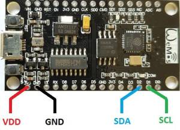
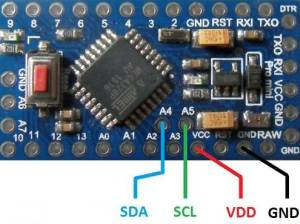

# ENS210
Arduino library for the ENS210 relative humidity and temperature sensor with I2C interface from ams

## Introduction
This project is an Arduino *library*. It implements a driver for the ENS210.
This chip is a relative humidity and temperature sensor with an I2C interface.
This driver is based on the code supplied by *ams*, the manufacturer of the chip.

The code has been tested with
 - [NodeMCU (ESP8266)](https://www.aliexpress.com/item/NodeMCU-V3-Lua-WIFI-module-integration-of-ESP8266-extra-memory-32M-flash-USB-serial-CP2102/32779738528.html)
 - [Arduino pro mini](https://www.aliexpress.com/item/ProMini-ATmega328P-3-3V-Compatible-for-Arduino-Pro-Mini/32525927539.html)
 - [Arduino nano](https://www.aliexpress.com/item/Nano-CH340-ATmega328P-MicroUSB-Compatible-for-Arduino-Nano-V3/32572612009.html)

Note that the ENS210 requires a supply voltage of 1.71V .. 3.6V.
So, 3.3V is ok, but *do not use a 5V board*.
The Nano has 3v3 supply, but runs I2C on 5V. This does seem to work.

## Links
The ENS210 is made by [ams](http://www.ams.com).
 - Find the datasheet of the ENS210 on the
   [product page](http://ams.com/eng/Products/Environmental-Sensors/Relative-Humidity-and-Temperature-Sensors/ENS210).
 - Find application notes and software on the
   [download page](https://download.ams.com/ENVIRONMENTAL-SENSORS/ENS210).

## Prerequisites
It is assumed that
 - The Arduino IDE has been installed.
   If not, refer to "Install the Arduino Desktop IDE" on the
   [Arduino site](https://www.arduino.cc/en/Guide/HomePage).
 - The library directory is at its default location.
   For me, Maarten, that is `C:\Users\maarten\Documents\Arduino\libraries`.

## Installation
Installation steps
 - Visit the [project page](https://github.com/maarten-pennings/ENS210) for the Arduino ENS210 library.
 - Click the green button `Clone or download` on the right side.
 - From the pop-up choose `Download ZIP`.
 - Unzip the file "Here", so that this `README.md` is in the top-level directory
   with the name `ENS210-master`.
 - Rename the top-level directory `ENS210-master` to `ENS210`.
 - Copy the entire tree to the Arduino library directory.
   This `README.md` should be located at e.g.
   `C:\Users\maarten\Documents\Arduino\libraries\ENS210\README.md`.

## Build an example
To build an example sketch
 - (Re)start Arduino.
 - Open File > Example > Examples from Custom Libraries > ENS210 > ENS210simple.
 - Make sure Tools > Board lists the correct board.
 - Select Sketch > Verify/Compile.

## Wiring
This library has been tested with three boards.

For the NodeMCU (ESP8266), connect as follows

| ENS210 | ESP8266 |
|:------:|:-------:|
|   VDD  |   3V3   |
|   GND  |   GND   |
|   SDA  |   D2    |
|   SCL  |   D1    |



For the Pro mini (do *not* use a 5V board), connect as follows

| ENS210 | Pro mini |
|:------:|:--------:|
|   VDD  |   VCC    |
|   GND  |   GND    |
|   SDA  |    A4    |
|   SCL  |    A5    |



For the Arduino Nano, connect as follows

| ENS210 |   Nano   |
|:------:|:--------:|
|   VDD  |   3V3    |
|   GND  |   GND    |
|   SDA  |    A4    |
|   SCL  |    A5    |


## Flash an example
To build an example sketch
 - (Re)start Arduino.
 - Open File > Example > Examples from Custom Libraries > ENS210 > ENS210simple.
 - Alternatively open File > Example > Examples from Custom Libraries > ENS210 > ENS210full.
 - In `setup()` make sure to start the I2C driver correctly.
   For example, for ESP8266 NodeMCU have
     ```C++
     Wire.begin(D2,D1); // For ESP8266 nodemcu boards [VDD to 3V3, GND to GND, SDA to D2, SCL to D1]
     // Wire.begin(); // Arduino pro mini or Nano [VDD to VCC/3V3, GND to GND, SDA to A4, SCL to A5]
     ```
   and for Arduino pro mini or Nano have
     ```C++
     // Wire.begin(D2,D1); // For ESP8266 nodemcu boards [VDD to 3V3, GND to GND, SDA to D2, SCL to D1]
     Wire.begin(); // Arduino pro mini or Nano [VDD to VCC/3V3, GND to GND, SDA to A4, SCL to A5]
     ```
 - Make sure Tools > Board lists the correct board.
 - Select Sketch > Upload.
 - Select Tools > Serial Monitor.
 - Enjoy the output, which should be like this for `ENS210simple`:

     ```Text
     Starting ENS210 simple demo
     19.9 C, 59 %RH
     23.1 C, 79 %RH
     23.1 C, 79 %RH
     27.7 C, 94 %RH
     26.5 C, 95 %RH
     23.5 C, 94 %RH
     21.1 C, 94 %RH
     20.2 C, 94 %RH
     20.1 C, 94 %RH
     19.4 C, 87 %RH
     19.3 C, 79 %RH
     19.3 C, 68 %RH
     ```


(end of doc)
