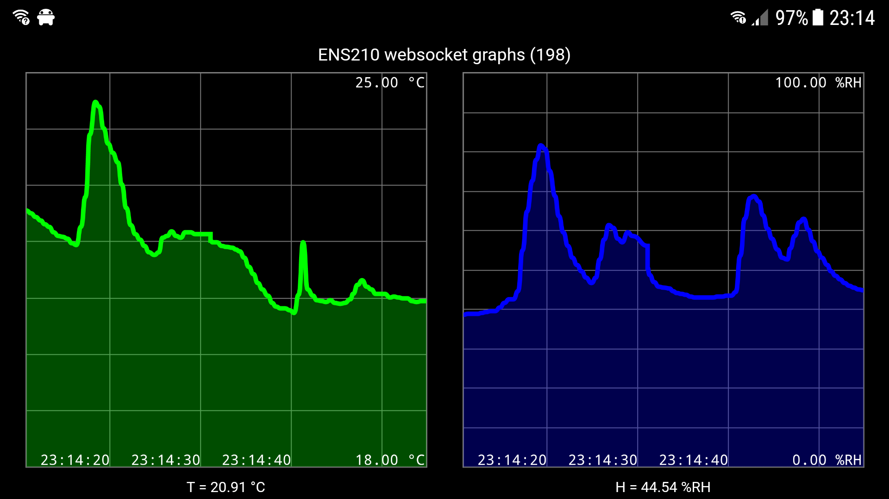

# ENS210 examples
There are several examples of increasing complexity.

## ens210simple
A simple demo sketch that prints measurement data from them ENS210,
relative humidity and temperature.

This is a bare minimum example.
It tries to not use any other libraries (it only uses `Serial` to print results, and `Wire` for I2C).
The ENS210 library is used without error error handling.

## ens210full
A sketch, that is simple like ens210simple in that it uses no other libraries.
But it does employ full error handling and it demos all conversions (Kelvin, Celsius, Fahrenheit).

## ens210thingspeak
A real application, not just a simple demo.
Reads temperature and humidity from the ENS210, and uploads that to a ThingSpeak channel.

This application uses several (standard) libraries, like WiFi and ThingSpeak.
It also requires you to create a ThingSpeak account and create an appropriate channel to receive the data.

This has only been tested on ESP8266.

## ens210websockets
An application that demos how to "push" measurement data (from ENS210) to web clients (using websockets).
The data appears in a simple list in the browser.
Uses several libraries: web server, websocket server, dns server, flash file system.

This has only been tested on ESP8266.

## ens210wsgraph
This application is an extension of the previous.
Data no longer appears in a list, but is shown in a graph, using the 
excellent [smoothie](http://smoothiecharts.org/) library.

This has only been tested on ESP8266.

Note that this example uses the flash file system of the ESP8266 (see ino for instructions).

Sample serial output:
'''Text
init: Welcome to ENS210 websockets v1
init: LED up
init: I2C up
init: ENS210 up
init: FFS up
init: AP config 'ENS210' at 10.10.10.10
init: AP up
init: DNS server up
init: WS server up
init: HTTP server up

data: 18.94°C (ok) 47.91%RH (ok) 500ms
data: 18.93°C (ok) 47.93%RH (ok) 500ms
data: 18.93°C (ok) 47.85%RH (ok) 500ms
data: 18.91°C (ok) 47.81%RH (ok) 500ms
data: 18.88°C (ok) 47.73%RH (ok) 500ms
data: 18.94°C (ok) 47.68%RH (ok) 500ms
data: 18.93°C (ok) 47.70%RH (ok) 500ms
data: 18.91°C (ok) 47.68%RH (ok) 500ms
data: 18.90°C (ok) 48.08%RH (ok) 500ms
data: 18.91°C (ok) 48.06%RH (ok) 500ms
http: req '/' ... sending 'index.html' size 5155 ... done
data: 18.94°C (ok) 48.07%RH (ok) 500ms
data: 18.91°C (ok) 48.08%RH (ok) 500ms
data: 18.91°C (ok) 48.06%RH (ok) 500ms
http: req '/smoothie.js' ... sending 'smoothie.js' size 12922 ... done
data: 18.91°C (ok) 48.06%RH (ok) 533ms
wsev: connected (slot 0)
data: 18.93°C (ok) 48.08%RH (ok) 500ms
data: 18.91°C (ok) 48.06%RH (ok) 500ms
data: 18.90°C (ok) 48.08%RH (ok) 500ms
data: 18.91°C (ok) 48.06%RH (ok) 500ms
data: 18.91°C (ok) 48.06%RH (ok) 500ms
'''

Screenshot connected phone

(end of doc)
